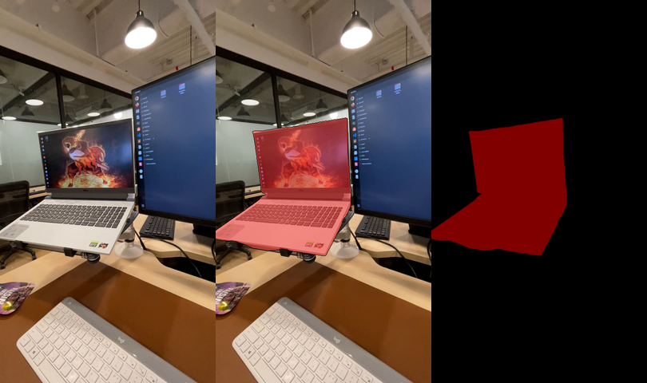

Need a tool to generate masks first.

Found MiVOS → [https://github.com/hkchengrex/MiVOS](https://github.com/hkchengrex/MiVOS)

```
git clone https://github.com/hkchengrex/MiVOS.git
cd MiVOS

# Install dependencies
conda create -n mivos python=3.7
conda activate mivos
pip install numpy Cython 
pip install PyQt5 davisinteractive progressbar2 opencv-python networkx gitpython gdown
conda install pytorch==1.7.1 torchvision==0.8.2 torchaudio==0.7.2 -c pytorch
pip install matplotlib

# Run
python download_model.py
python interactive_gui.py --images <path to a folder of images>
```

Have to download bunch of `pth` models as well.

Faced **conflict between PyQt5 and opencv-python.**

```
pip uninstall opencv-python
pip install opencv-python-headless
```

```
python interactive_gui.py --images <path to a folder of images>
python interactive_gui.py --video <path to video>
```

Memory issue faced.

```
RuntimeError: CUDA out of memory. Tried to allocate 80.00 MiB 
(GPU 0; 5.80 GiB total capacity; 3.23 GiB already allocated; 
56.31 MiB free; 3.39 GiB reserved in total by PyTorch)
```

Also do this if you have `export QT_QPA_PLATFORM=offscreen` in `zshrc` or `bashrc`. :

```
export QT_QPA_PLATFORM=xcb
```

Need to test it on the server with X11.

Using on the remote server with RDP. Got the mask results for a sample.



Also found a tool `imagemagick` to combine images in Linux.

```
convert img1.png img2.png +append joined_horizontal.png
convert img1.png img2.png -append joined_vertical.png

convert img1.png img2.png -resize x512 +append joined_horizontal.png
```
